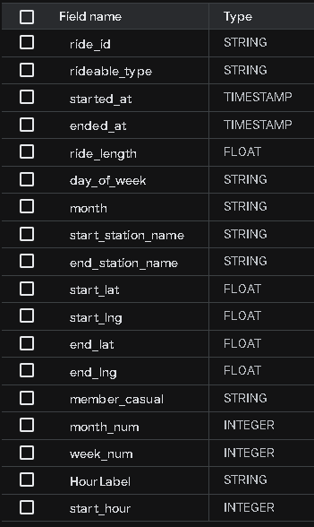
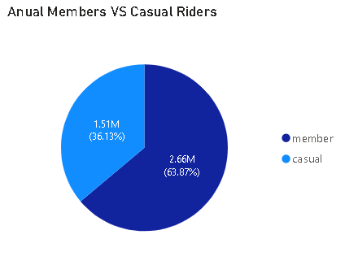
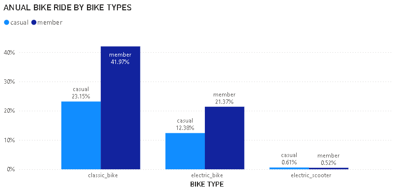
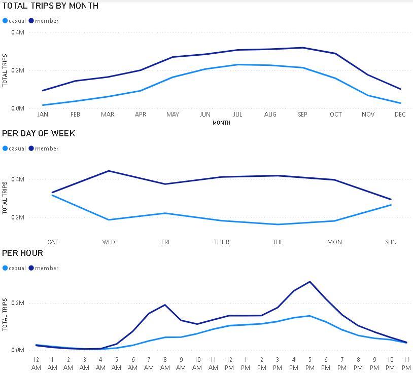
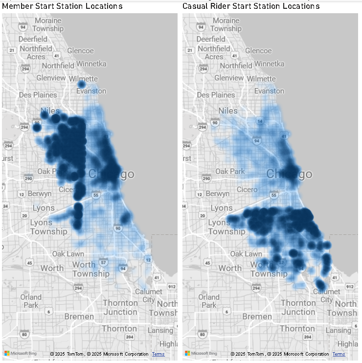
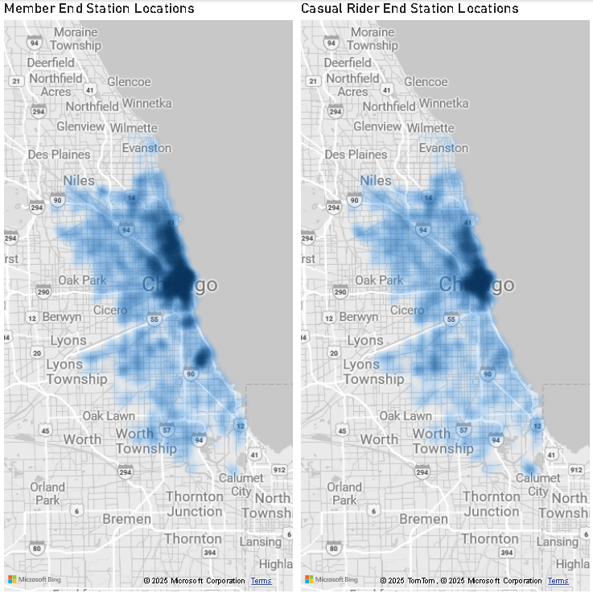

# Google Data Analytics Capstone Case Study
Course: [Google Data Analytics Capstone: Complete a Case Study](https://www.coursera.org/learn/google-data-analytics-capstone)

### Introduction

In this case study, I perform the role of a junior data analyst at a fictional company, Cyclistic - a bike-share company in Chicago. The company's business goal is to increase the number of annual members. To achieve this, the marketing team believes there is a great opportunity to convert casual riders into annual members. This project analyzes trip data of a whole year to understand the behavioral differences between these two rider types. The insights from this analysis will be used to design a data-driven marketing strategy. The data for this project is public data provided by [Divvy](https://divvy-tripdata.s3.amazonaws.com/index.html) for the period of January to December 2024, and it is made available under this [license](https://www.divvybikes.com/data-license-agreement).

The analysis uses the following 12 monthly data files:

* 202401-divvy-tripdata
* 202402-divvy-tripdata
* 202403-divvy-tripdata
* 202404-divvy-tripdata
* 202405-divvy-tripdata
* 202406-divvy-tripdata
* 202407-divvy-tripdata
* 202408-divvy-tripdata
* 202409-divvy-tripdata
* 202410-divvy-tripdata
* 202411-divvy-tripdata
* 202412-divvy-tripdata

### Project Overview

Cyclistic is a bike-share program that launched in 2016. Since then, the program has grown to a fleet of more than 5,800 bicycles that are geotracked and locked into a network of over 600 docking stations across Chicago. The bikes can be unlocked from one station and returned to any other station in the system anytime. Cyclistic sets itself apart by also offering reclining bikes, hand tricycles, and cargo bikes, making bike-share more inclusive to people with disabilities and riders who can’t use a standard two-wheeled bike. The majority of riders opt for traditional bikes. While Cyclistic users are more likely to ride for leisure, about 30% of them use the bikes to commute to work each day.

Until now, Cyclistic’s marketing strategy has focused on building general brand awareness. The company offers flexible pricing plans, including single-ride passes, full-day passes, and annual memberships. Customers who purchase single-ride or full-day passes are referred to as casual riders, while those who purchase annual memberships are Cyclistic members.

The company's finance analysts have concluded that annual members are significantly more profitable than casual riders. To drive future growth, the director of marketing, Moreno, believes there is a great opportunity to convert casual riders into annual members. She notes that casual riders are already aware of the program and have chosen Cyclistic for their mobility needs.

Moreno has set a clear goal: to design marketing strategies aimed at converting casual riders into annual members. To do this, the marketing team needs to better understand how annual members and casual riders differ, why casual riders might buy a membership, and how digital media could be used to influence their decisions. The team will analyze historical bike trip data to identify these trends.

### Project Scenario

I am a junior data analyst working on the marketing analyst team at Cyclistic, a bike-share company in Chicago. The director of marketing believes that the company's future success depends on maximizing the number of annual memberships. Therefore, my team wants to understand how casual riders and annual members use Cyclistic bikes differently. From these insights, my team will design a new marketing strategy to convert casual riders into annual members. But first, Cyclistic executives must approve my recommendations, so they must be backed up with compelling data insights and professional data visualizations.

### Analysis Questions

Three questions will guide the future marketing program:

1. How do annual members and casual riders use Cyclistic bikes differently?
2. Why would casual riders buy Cyclistic annual memberships?
3. How can Cyclistic use digital media to influence casual riders to become members?

### Analysis Process

### Process

BigQuery was used to manage, combine, and clean the data. As the dataset contained over 5 million rows, using a platform like BigQuery was essential for handling the large volume of data efficiently.

The following steps were performed to prepare the data for analysis:

* **Combining Data:** All 12 monthly CSV files were combined into a single table.
* **Data Cleaning and Transformation:** SQL queries were used to remove rows with missing values, and new columns were created for trip duration, day of the week, month, start_hour and HourLabel,
   to aid in the analysis of trip times.
    All the rows having missing values are deleted, Trips with duration less than a minute and longer than a day are excluded.
* **Primary Key:** The `ride_id` was identified as the primary key, and it was used to check for and remove any duplicate rows.
  
You can find the complete SQL script for these steps in the [SQL Queries](sql/data_cleaning_and_transformation.sql) section of this repository.

#### Observations

The table below shows the column names and their data types. The `ride_id` column is our primary key.

## Analysis Summary

I used Power BI for visualization. To handle the large volume of data, I chose the DirectQuery connection method, which allows Power BI to connect live to the data source without loading it all into memory. This ensures the analysis remains efficient and scalable.
Question: How do annual members and casual riders use Cyclistic bikes differently?

#### Rider Composition

.

This pie chart shows the overall distribution of rides between annual members and casual riders. It reveals that casual riders make up 36.13% of all trips, which represents a significant opportunity to convert them into annual memberships. Annual members, who are more profitable, account for the majority of rides at 63.87%.

#### Bike Type Preference

.

This chart compares the distribution of bike types between members and casual riders. It shows that both groups primarily prefer classic bikes.
However, members make up a much larger percentage of total rides on classic bikes (41.97%) compared to casual riders (23.15%). For electric bikes, the usage is more balanced, with members accounting for 21.37% of rides and casuals at 12.38%. The use of electric_scooter is negligible for both groups.

#### Trip Analysis

The following charts compare the riding patterns of annual members and casual riders.

.

* The "Total Trips by Month" chart shows that both groups follow a similar seasonal pattern, with riding activity peaking in the summer months.
* The "Per Day of Week" chart reveals a clear difference: members ride consistently throughout the week, while casual riders have a significant increase in trips over the weekend.
* The "Per Hour" chart reinforces this, showing two distinct peaks for members (morning and evening), a pattern consistent with commuting. In contrast, casual riders have a single peak in the afternoon, which is typical of leisure use.

These findings collectively and strongly suggest that annual members use Cyclistic bikes for commuting, while casual riders use them for leisure.

To further understand the differences in casual and member riders, the geographical locations of starting and ending stations were analyzed. These heatmaps provide powerful evidence of their distinct usage patterns.

#### Starting Station Locations

This heatmap visualizes the density of starting locations for both rider types. The visual provides strong evidence of different usage patterns:

- **Members** show a highly concentrated and dense pattern of activity, with dark blue clusters in central business districts like The Loop. This is typical of daily commuting.
- **Casual riders** show a more diffused and spread-out pattern of activity across the city. This is consistent with using bikes for leisure, tourism, or exploring.

#### Ending Station Locations

A similar trend can be observed in the end station locations. The heatmap for members shows a high concentration of activity in the same central business districts where their rides began. This pattern reinforces the conclusion that members rely on bikes for daily commutes. In contrast, the end locations for casual riders are more spread out, supporting the idea that they are using the service for leisure activities with less fixed routes.

#### Summary of Findings

Our analysis of over 5.8 million bike trips revealed fundamental differences in how annual members and casual riders use Cyclistic bikes.

**Usage Patterns:** Annual members have a clear commuting pattern, with high usage on weekdays and two distinct peaks (morning and evening). In contrast, casual riders show a strong leisure pattern, with their highest usage on weekends and a single peak in the afternoon.

**Seasonality:** Both groups are most active during the spring and summer, but members consistently have a higher number of trips all year.

**Location:** Member activity is highly concentrated in central business districts, which supports the commuting idea. Casual rider activity is more spread out, consistent with tourism and recreational activities.

#### Recommendations
Based on these key insights, here are a few ideas to help convert casual riders into annual members:

- Introduce Flexible Membership Options: We should offer special memberships for things like weekends only or for the summer season. Since casual riders use bikes most on weekends and in the summer, these plans would be a great deal for them and could   get them to sign up.
- Launch a Targeted Digital Media Campaign: We should run ads at the right time and in the right places. For example, ads could be placed at popular parks and stations during weekends and summer months. The message should be about how much money they    could save with a membership.
- Refocus Ad Messaging: The ads should speak directly to casual riders. Instead of just trying to get new people, the ads should compare the cost of a few weekend rides to the value of an annual membership. 

